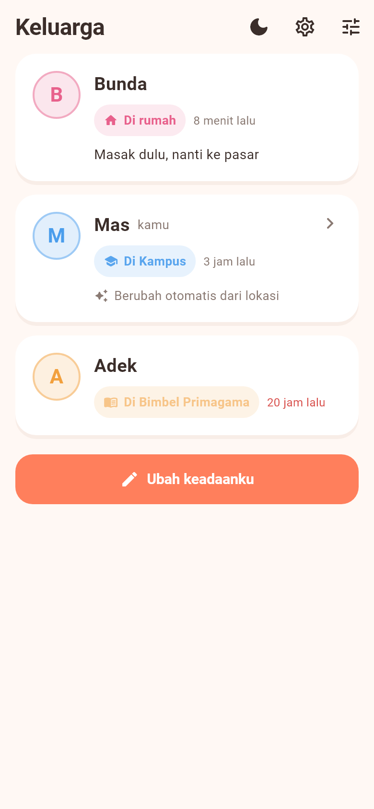
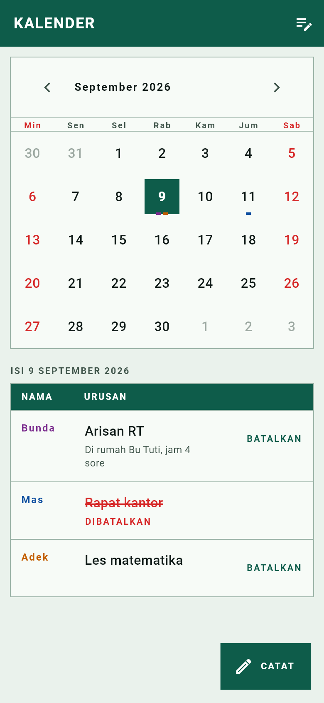
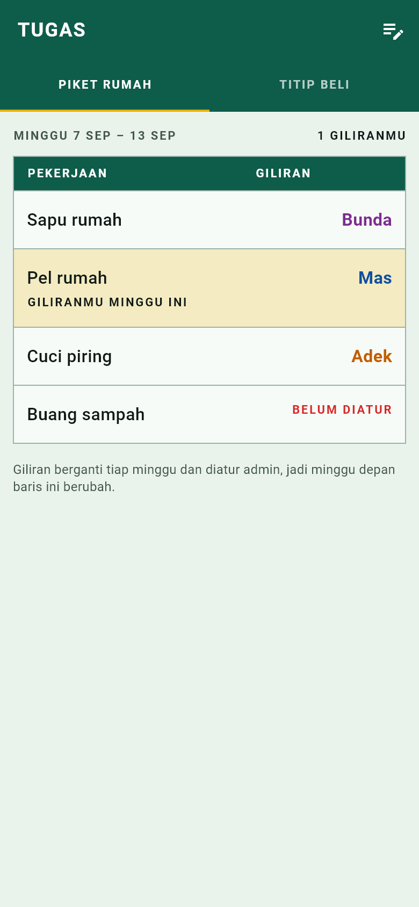
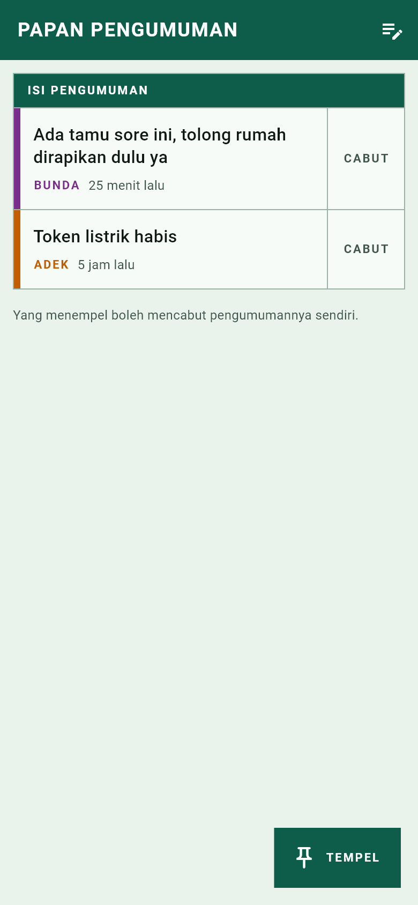
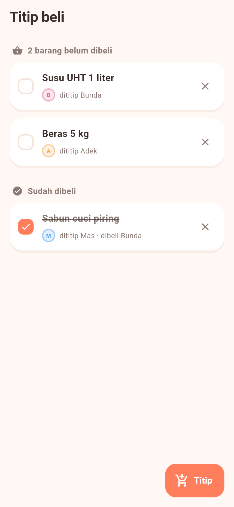
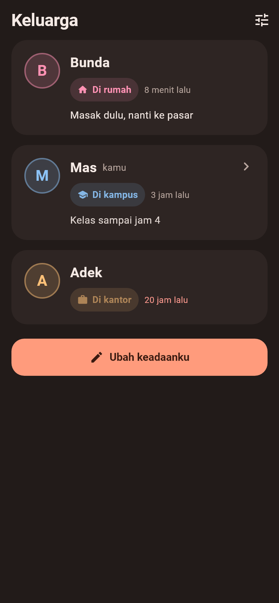

# Family App Tracking

Aplikasi Android untuk koordinasi harian keluarga — dipakai bertiga (Bunda, Aku, Adek) di HP masing-masing.

Dibuat karena hal-hal kecil sehari-hari ("kamu di mana?", "token listrik habis", "minggu ini siapa yang piket?", "tolong beliin susu") selalu berujung buka WhatsApp, ngetik, lalu nunggu dibalas. Di app ini semuanya sudah kelihatan tanpa perlu bertanya.

## Get it

| Target | Cara dapat |
|---|---|
| Android | APK, debug signed — [latest release](../../releases/latest), file `family-app-tracking.apk` |

Install langsung dari file APK-nya (perlu izinkan "install dari sumber tidak dikenal" sekali di HP).

## Tampilan

Rumah tangga ditampilkan sebagai **register Kartu Keluarga**: tiap anggota satu baris bernomor dengan tinta sendiri, tiap keadaan satu kolom yang dicap beserta jamnya. Keadaan yang lewat 12 jam diarsir sendiri dan ditandai "belum diperbarui", supaya kabar semalam tidak dikira masih berlaku.

| Kartu Keluarga | Kalender | Piket rumah |
|---|---|---|
|  |  |  |

| Pengumuman | Titip beli | Mode gelap |
|---|---|---|
|  |  |  |

Gambar-gambar itu bukan mockup — semuanya dirender langsung dari widget aplikasi lewat `flutter test --update-goldens test/design_preview_test.dart`, memakai data contoh.

## Fitur

- **Kalender** — tiap anggota mengisi jadwalnya di tanggal tertentu, yang lain bisa lihat.
- **Status** — di rumah / di kampus / di kantor / tidur, plus keterangan singkat opsional (misal "OTW pulang, telat 30 menit").
- **Papan Pengumuman** — catatan singkat yang langsung terlihat semua anggota.
- **Tugas** — daftar piket rumah yang rolling tiap minggu, plus daftar titip beli bersama.
- **Peta** — posisi anggota yang mengaktifkan berbagi lokasi.
- **Admin** — satu profil bertindak sebagai admin: bisa membatalkan jadwal orang lain dan mengatur rotasi piket.

Tidak ada login akun — tiap HP cukup memilih "kamu siapa" sekali, lalu diingat secara lokal.

## Stack

Flutter (Android) · Cloud Firestore · Google Maps · Firebase Cloud Messaging

## Menjalankan sendiri

App ini terhubung ke project Firebase pribadi, jadi konfigurasinya tidak ikut di repo ini. Untuk menjalankan:

1. Buat project Firebase, tambahkan app Android dengan package `com.keluarga.family_app`, lalu simpan `google-services.json` ke `android/app/`.
2. Aktifkan Cloud Firestore, lalu deploy aturan dari `firestore.rules`.
3. Buat Google Maps API key (Maps SDK for Android), salin `android/secrets.properties.example` menjadi `android/secrets.properties`, lalu isi `MAPS_API_KEY`.
4. `flutter pub get` lalu `flutter run`.

> Catatan keamanan: karena app ini tanpa autentikasi, aturan Firestore-nya memang longgar — cocok untuk 3 anggota keluarga yang saling percaya, bukan untuk data yang perlu dijaga dari publik. Karena itu `google-services.json` sengaja tidak dimasukkan ke repo.
