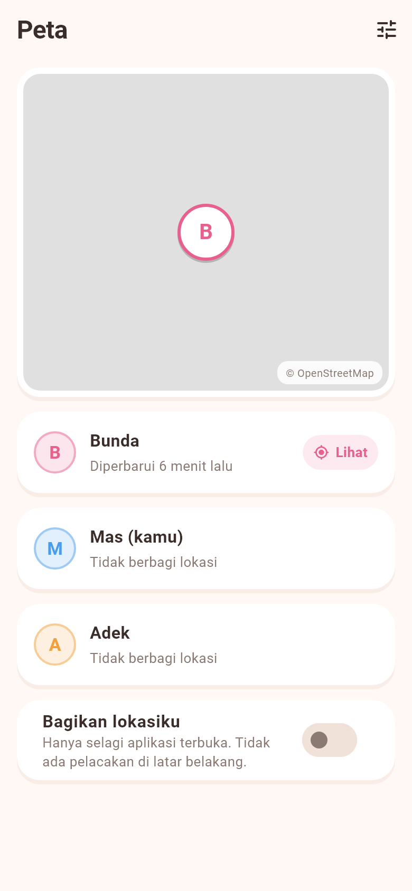
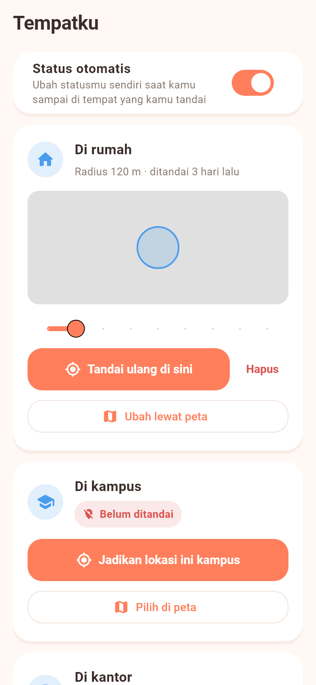
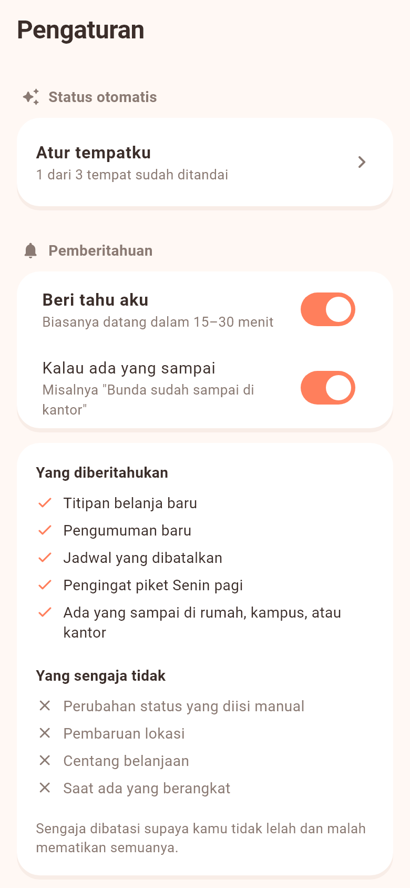

# Family App Tracking

Aplikasi Android untuk koordinasi harian keluarga — dipakai bertiga (Bunda, Aku, Adek) di HP masing-masing.

Dibuat karena hal-hal kecil sehari-hari ("kamu di mana?", "token listrik habis", "minggu ini siapa yang piket?", "tolong beliin susu") selalu berujung buka WhatsApp, ngetik, lalu nunggu dibalas. Di app ini semuanya sudah kelihatan tanpa perlu bertanya.

## Get it

| Target | Cara dapat |
|---|---|
| Browser | Coba dulu tanpa memasang apa pun — [buka demo](https://kimipriabadi3.github.io/family-app-tracking/) |
| Android | APK dari [latest release](../../releases/latest) — `family-app-tracking-arm64.apk` (19,8 MB) untuk hampir semua HP sekarang, atau `family-app-tracking-arm32.apk` (17,4 MB) untuk HP lama |

Install APK langsung dari filenya (perlu izinkan "install dari sumber tidak dikenal" sekali di HP).

Demonya berjalan di atas data karangan yang hidup di tab kamu sendiri: semua tombol berfungsi, tapi tidak menyentuh data keluarga yang asli dan hilang begitu halaman ditutup. Di sana ada pemilih **Lihat sebagai Bunda / Mas / Adek**, jadi kamu bisa merasakan tampilan yang sama dari HP yang berbeda — termasuk melihat menu Admin yang hanya muncul untuk satu orang.

## Tampilan

Hangat dan lembut, bukan formulir: kartu membulat berbayang halus di atas latar krem, palet koral–kuning–tosca, dan satu warna khas per anggota yang dipakai konsisten di semua layar — jadi warna saja sudah memberi tahu ini punya siapa.

Satu detail yang paling berguna sehari-hari: **status menua sendiri**. Yang baru diisi tampil pekat, yang sudah lebih dari 12 jam memudar dan waktunya berubah merah, supaya kabar semalam tidak dikira masih berlaku.

| Keluarga | Kalender | Piket rumah |
|---|---|---|
|  |  |  |

| Pengumuman | Titip beli | Mode gelap |
|---|---|---|
|  |  |  |

| Peta | Tempatku | Pengaturan |
|---|---|---|
|  |  |  |

Gambar-gambar itu bukan mockup — semuanya dirender langsung dari widget aplikasi lewat `flutter test --update-goldens test/design_preview_test.dart`, memakai data contoh.

## Fitur

- **Kalender** — tiap anggota mengisi jadwalnya di tanggal tertentu, yang lain bisa lihat.
- **Status** — di rumah / di kampus / di kantor / di jalan / tidur, plus keterangan singkat opsional (misal "OTW pulang, telat 30 menit").
- **Status otomatis** — tandai rumah, kampus, atau kantor sekali, entah langsung di tempatnya atau dengan memilih titiknya di peta dari mana saja; status berubah sendiri saat kamu tiba dan jadi "Di jalan" saat pergi. Status yang kamu isi manual tetap dihormati sampai kamu benar-benar berpindah tempat.
- **Notifikasi** — titipan belanja baru, pengumuman baru, jadwal yang dibatalkan, pengingat piket Senin pagi, dan kabar saat ada anggota yang tiba. Sengaja tidak untuk hal yang bikin berisik: perubahan status manual, keberangkatan, pembaruan lokasi.
- **Papan Pengumuman** — catatan singkat yang langsung terlihat semua anggota.
- **Tugas** — daftar piket rumah yang rolling tiap minggu, plus daftar titip beli bersama.
- **Peta** — posisi anggota yang mengaktifkan berbagi lokasi.
- **Admin** — satu profil bertindak sebagai admin: bisa membatalkan jadwal orang lain dan mengatur rotasi piket.

Tidak ada login akun — tiap HP cukup memilih "kamu siapa" sekali, lalu diingat secara lokal.

## Stack

Flutter (Android) · Cloud Firestore · OpenStreetMap lewat `flutter_map` · geofence Android lewat `native_geofence` · `workmanager` + `flutter_local_notifications`

Peta sengaja memakai OpenStreetMap, bukan Google Maps: tidak butuh API key dan tidak butuh akun penagihan, jadi APK yang dibagikan tidak membawa kredensial apa pun yang bisa disalahgunakan.

Notifikasi juga tanpa server: tiap HP memeriksa sendiri kira-kira tiap 15 menit, jadi tidak perlu Cloud Functions dan tidak perlu kartu kredit. Gantinya, notifikasi biasanya datang 15–30 menit setelah kejadian, bukan seketika.

Koordinat rumah, kampus, dan kantor untuk status otomatis **hanya disimpan di HP masing-masing** dan tidak pernah dikirim ke database. Yang dibagikan ke keluarga cuma hasilnya, misalnya "Bunda di kantor".

## Supaya status otomatis dan notifikasi tetap jalan

- **Jangan "force stop" aplikasinya.** Android akan mematikan semua kerja latar belakang sampai aplikasi dibuka lagi.
- **Izinkan lokasi "sepanjang waktu"** untuk status otomatis — aplikasi cuma dibangunkan saat kamu masuk atau keluar tempat yang ditandai, tidak dipantau terus-menerus.
- **Keluarkan dari penghemat baterai** kalau HP-mu Xiaomi, Samsung, Oppo, Realme, atau Vivo. Petunjuk per merek ada di layar Pengaturan.
- Status otomatis butuh sekitar 3–6 menit setelah benar-benar sampai.

## Menjalankan sendiri

App ini terhubung ke project Firebase pribadi, jadi konfigurasinya tidak ikut di repo ini. Untuk menjalankan:

1. Buat project Firebase, tambahkan app Android dengan package `com.keluarga.family_app`, lalu simpan `google-services.json` ke `android/app/`.
2. Aktifkan Cloud Firestore, lalu deploy aturan dari `firestore.rules`.
3. `flutter pub get` lalu `flutter run`.

Tidak ada kunci peta yang perlu diisi.

> Catatan keamanan: karena app ini tanpa autentikasi, aturan Firestore-nya memang longgar — cocok untuk 3 anggota keluarga yang saling percaya, bukan untuk data yang perlu dijaga dari publik. Karena itu `google-services.json` sengaja tidak dimasukkan ke repo.
